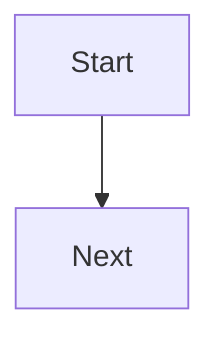

# Contract: Working Doc Mermaid Diagrams

Mermaid diagrams are stored as plain markdown inside working docs.

## Insert Diagram Action

Surface editor behavior:

- Available only while editing a working doc.
- Inserts a fenced Mermaid block at the current cursor or selection.
- Keeps keyboard focus predictable after insertion.

Inserted template:

````markdown

````

## Rendering

Viewer behavior:

- Valid fenced `mermaid` blocks render inline as SVG through the existing markdown renderer.
- Source text remains editable in the working-doc editor.
- Diagram source remains searchable because it is stored in working-doc markdown.

Error behavior:

- Invalid Mermaid syntax displays a clear non-destructive error near the preview.
- The original source text remains present and editable.
- Error output is keyboard reachable and screen-reader understandable.

Out of scope:

- Freeform canvas.
- Image annotation.
- OCR.
